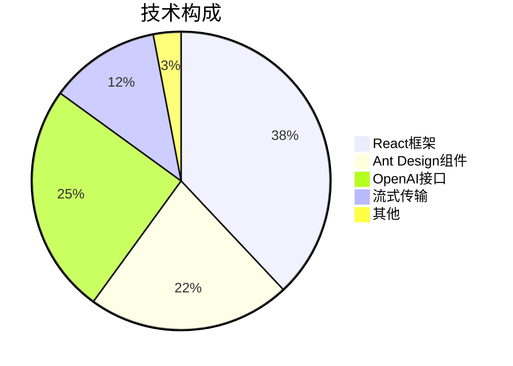
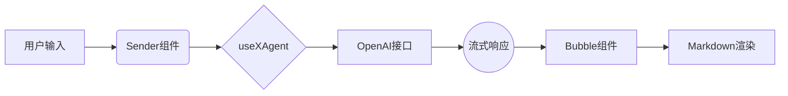

# 🤖 Antdx 智能聊天助手

[](https://codesandbox.io/p/github/z1811021/deepseek-demo/main)



## 👩💻 给普通用户的话
### 🤔 这是什么东西？
这是一个会聊天的网页机器人，就像你手机里的Siri或小爱同学，但更聪明：
- 🧠 **聪明大脑**：使用DeepSeek公司研发的AI模型
- ✍️ **手写效果**：回复会逐字出现，像真人打字
- 📚 **知识丰富**：能聊科技、生活、学习等话题

### 🌟 特色功能解析
| 功能               | 你能感受到的              | 背后的技术故事          |
|--------------------|--------------------------|-------------------------|
| 实时对话           | 提问后立即得到回应        | 5G网络+智能算法         |
| 智能断句           | 回复分段显示更自然        | 自然语言处理技术        |
| 记忆上下文         | 能接着上文继续聊          | 对话历史记录技术        |
| 多格式支持         | 显示代码/表格等专业内容    | Markdown翻译器          |

### 🧩 技术小白科普
**1. 什么是OpenAI？**  
就像给机器人安装了一个超级大脑，这个大脑由人工智能公司开发，能够：
- 📖 阅读海量书籍和网页
- 💡 理解复杂的问题
- ✏️ 生成人性化的回复

**2. 流式响应是什么？**  
传统机器人：等待10秒 → 显示完整回答  
我们的机器人：立即回复 → 逐字补充（就像真人聊天）

**3. 为什么要API密钥？**  
好比手机的SIM卡：
- 🔑 唯一身份标识
- 📱 连接网络的通行证
- ⚠️ 注意：不要分享给他人！

## 🛠️ 开发者快速启动
### 本地运行
```bash
# 克隆仓库
git clone https://github.com/z1811021/deepseek-demo


# 安装依赖（任选其一）
npm install   # 标准安装
pnpm install  # 快速安装
yarn          # 兼容安装

# 启动开发服务器
npm run dev
```

### 核心配置
```typescript
// src/App.tsx - OpenAI配置
const client = new OpenAI({
  baseURL: "https://api.deepseek.com/v1",
  apiKey: import.meta.env.VITE_DEEPSEEK_API_KEY, // 安全读取
  dangerouslyAllowBrowser: true,
});

// 流式响应处理
const stream = await client.chat.completions.create({
  model: "deepseek-reasoner",
  messages: [{ role: "user", content: message }],
  stream: true,
  temperature: 0.7,
});
```

## 🎨 技术架构
### 组件架构


### 技术栈
| 技术             | 用途                  | 版本   | 文档                      |
|------------------|-----------------------|--------|---------------------------|
| React            | 核心框架              | 18.2+  | [文档](https://react.dev) |
| Ant Design       | UI组件库              | 5.16+  | [官网](https://ant.design)|
| OpenAI SDK       | AI接口交互            | 4.33+  | [API文档](https://platform.openai.com/docs)|
| DeepSeek         | 中文优化模型          | 1.0+   | [文档](https://deepseek.com)|
| Vite             | 开发工具链            | 4.4+   | [指南](https://vitejs.dev)|

## 🔐 安全实践
```diff
// 正确配置方式
- const apiKey = "sk-xxx" // 危险！明文存储
+ const apiKey = import.meta.env.VITE_DEEPSEEK_API_KEY // 安全方式
```

```bash
# 生产环境构建
npm run build && npm run preview
```

## 🌐 学习资源
### 核心技术
- [Ant Design 组件文档](https://ant.design/components/overview/)
- [OpenAI Stream API](https://platform.openai.com/docs/api-reference/streaming)
- [Vite 环境变量配置](https://vitejs.dev/guide/env-and-mode.html)

### 扩展阅读
- [React性能优化](https://react.dev/learn/render-and-commit)
- [Markdown高级用法](https://www.markdownguide.org/extended-syntax/)


